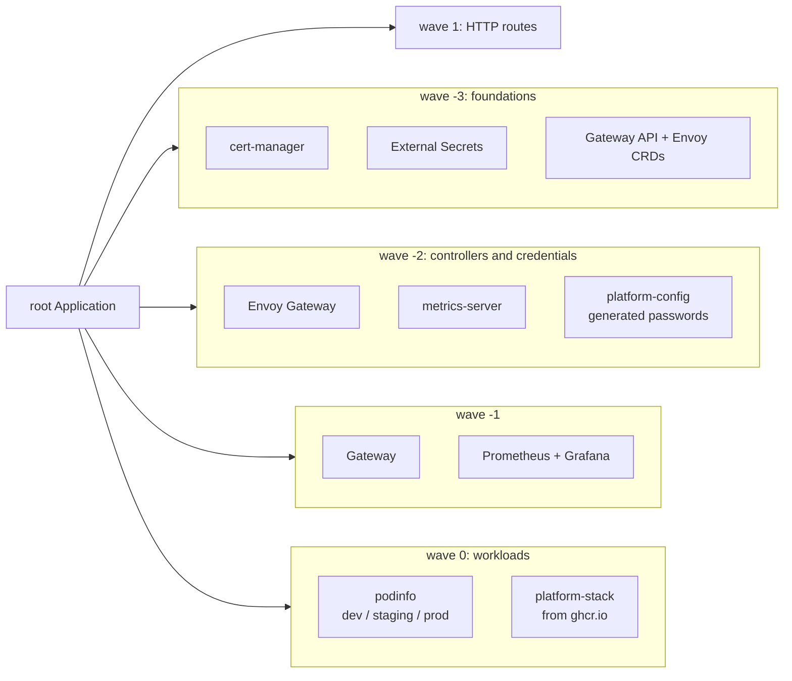

# gitops-platform

A Kubernetes platform delivered entirely through Argo CD: one root Application renders every other one, in sync waves, from this repository. It deploys shared platform components, a sample service promoted through three environments, and the `platform-stack` Helm chart from [helm-umbrella-platform](https://github.com/vlad-radu-anca/helm-umbrella-platform), pulled from GitHub Container Registry.

[](https://github.com/vlad-radu-anca/gitops-platform/actions/workflows/validate.yaml)
[](https://github.com/vlad-radu-anca/gitops-platform/actions/workflows/e2e.yaml)
[](LICENSE)

The e2e badge is the point: every pull request builds a real cluster in CI, lets Argo CD deploy the whole platform from that pull request's commit, and only passes once every Application is synced and healthy and each service answers through the gateway.

## What gets deployed



| Wave | Application | Source |
|---|---|---|
| -3 | `cert-manager` | Jetstack chart, CRDs managed by the chart |
| -3 | `external-secrets` | External Secrets Operator |
| -3 | `envoy-gateway-crds` | Gateway API and Envoy Gateway CRDs |
| -2 | `envoy-gateway` | Envoy Gateway controller |
| -2 | `metrics-server` | Resource metrics for `kubectl top` and autoscaling |
| -2 | `platform-config` | Namespaces and generated credentials ([manifests/platform-config](manifests/platform-config)) |
| -1 | `gateway` | `GatewayClass`, `Gateway`, Envoy proxy settings ([manifests/gateway](manifests/gateway)) |
| -1 | `monitoring` | kube-prometheus-stack (Prometheus, Grafana) |
| 0 | `podinfo-dev`, `podinfo-staging`, `podinfo-prod` | Generated by an ApplicationSet, values per environment |
| 0 | `platform-stack` | `oci://ghcr.io/vlad-radu-anca/platform-stack`, values from [environments/platform-stack](environments/platform-stack/values.yaml) |
| 1 | `routes` | `HTTPRoute`s for every service ([manifests/routes](manifests/routes)) |

Each wave waits for the previous one to be **healthy**, not merely created. That only works because of a health check for `Application` resources in [bootstrap/argocd-values.yaml](bootstrap/argocd-values.yaml): Argo CD stopped assessing it in 1.8, and without it the waves in an app-of-apps order creation and nothing more.

## Promotion

podinfo runs in three environments from one ApplicationSet. Each environment's settings live in `environments/<env>/podinfo.yaml`, and promotion is a pull request against those files:

| Environment | Replicas | Version |
|---|---|---|
| dev | 1 | 6.15.0 |
| staging | 2 | 6.15.0 |
| prod | 2 | 6.14.0, held back until 6.15.0 has proven itself in staging |

The e2e smoke test reads the expected version from those files and asserts that each environment actually serves it, so a promotion is verified end to end.

## Secrets

No secret is stored in this repository. Elasticsearch and Grafana credentials are generated inside the cluster by an External Secrets `Password` generator, with `refreshPolicy: CreatedOnce` so they are not rotated underneath a running service. The same manifests work on any fresh cluster. In production the `ExternalSecret` would read from a `ClusterSecretStore` backed by AWS Secrets Manager instead; nothing else changes.

## platform-stack, and why only part of it

The umbrella chart bundles 19 services. Most of them run application images that are not publicly available, so this repository deploys the slice that is built entirely on public images: **Elasticsearch and Kibana**, with everything else switched off in [environments/platform-stack/values.yaml](environments/platform-stack/values.yaml). That file is also where the production sizing (three replicas with a 3 GB heap each) is scaled down to fit a laptop or a CI runner.

`make validate` enforces this: it renders the chart with these values and fails if any image would be pulled from the non-public namespace.

Wiring this up surfaced real defects in the chart, all fixed upstream with regression tests: Elasticsearch probes that rendered `port: null` (Kubernetes rejected the StatefulSet), a duplicated `resources` key that silently dropped Kibana's limits, and a configuration job that could not be switched off.

## Running it locally

Runs anywhere kind runs: any Linux host with Docker, or macOS with Docker Desktop or OrbStack. Linux is the reference platform, since the e2e workflow deploys the whole stack on an Ubuntu runner for every pull request, and a full deploy takes about 8 minutes there. You need about 8 GB of memory for containers, plus [kind](https://kind.sigs.k8s.io) 0.33 or later, kubectl and Helm.

Elasticsearch needs `vm.max_map_count` of at least 262144 on the host. Its init container sets it, which works on most setups; if your host blocks privileged containers, run `sudo sysctl -w vm.max_map_count=262144` first.

```sh
make up         # cluster, Argo CD, root Application, then wait until healthy
make status     # Applications with sync and health status
make password   # initial Argo CD admin password
make down       # delete the cluster
```

Services are exposed through Envoy Gateway on `localhost:8080` (`localtest.me` resolves to 127.0.0.1):

| URL | |
|---|---|
| http://argocd.localtest.me:8080 | Argo CD (user `admin`, password from `make password`) |
| http://podinfo-dev.localtest.me:8080 | podinfo, also `-staging` and `-prod` |
| http://kibana.localtest.me:8080 | Kibana |
| http://grafana.localtest.me:8080 | Grafana (credentials in the `grafana-admin` secret, `monitoring` namespace) |

On a smaller machine, set `monitoring.enabled: false` in [charts/apps/values.yaml](charts/apps/values.yaml) to leave out Prometheus and Grafana.

## CI

| Workflow | When | What |
|---|---|---|
| [validate](.github/workflows/validate.yaml) | every push and pull request | Renders the app-of-apps and every chart it deploys with this repository's values, and validates the output against the Kubernetes API schema and the CRD schemas for Argo CD, External Secrets, Gateway API and Envoy Gateway. No cluster needed. |
| [e2e](.github/workflows/e2e.yaml) | every push and pull request, weekly, on demand | Creates a kind cluster, installs Argo CD, deploys the root Application **at the commit under test**, waits for every Application to be synced and healthy, then runs the smoke tests. The weekly run catches breakage that comes from outside the repository. |

The job summary of each e2e run lists every Application with its wave, sync and health status, and the podinfo version running in each environment.

## Design notes

- **One revision, everywhere.** The root Application passes its revision down to every Application that reads from this repository, so a pull request is deployed entirely from its own commit, not partly from `main`.
- **ApplicationSet inside a Helm chart.** ApplicationSet templates use the same double-brace syntax as Helm, so the ApplicationSet placeholders in [charts/apps/templates/podinfo.yaml](charts/apps/templates/podinfo.yaml) are wrapped in Helm raw strings to pass through untouched.
- **CRDs as templates.** Helm installs a chart's `crds/` folder once and never upgrades it. Gateway API and Envoy Gateway CRDs come from the dedicated CRDs chart, which ships them as templates, so Argo CD keeps them current. cert-manager and External Secrets do the same through their chart settings.
- **Server-side apply** for every Application, because the largest CRDs exceed the annotation size limit of client-side apply.
- **Routes deploy last.** An `HTTPRoute` for a Service that does not exist yet would hold its whole wave back, so routes form their own final wave. The podinfo Applications are generated by the ApplicationSet rather than being children of the root, so this wave waits for the ApplicationSet, not for them; the `routes` Application retries until their namespaces exist.
- **Envoy Gateway rather than ingress-nginx.** The ingress-nginx project was retired in 2026. Routing uses the Kubernetes Gateway API.
- **Prune disabled on namespaces.** Deleting an Application must never take a namespace, and everything in it, along with it.

## Related repositories

- [helm-umbrella-platform](https://github.com/vlad-radu-anca/helm-umbrella-platform): the Helm charts and their OCI publishing pipeline
- [terraform-templates](https://github.com/vlad-radu-anca/terraform-templates): Terraform modules, including the EKS module a production version of this platform would run on
- [aws-landing-zone](https://github.com/vlad-radu-anca/aws-landing-zone): the multi-account AWS foundation around it

## License

[Apache-2.0](LICENSE)
